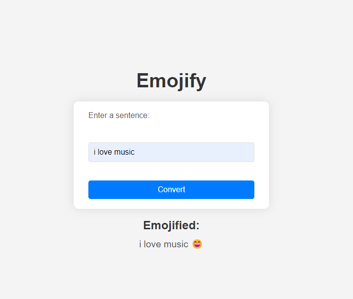

# Emojify Your Sentence with LSTM

This project uses a Long Short-Term Memory (LSTM) model to predict emojis based on the input sentence. The model has been trained with an accuracy of 86% and is saved in the `emojify.h5` file. Additionally, a Flask application is provided to submit POST requests for emoji conversion. There is also a Jupyter Notebook available to help you get familiar with the project.

## Preview



## Project Structure

- `emojfier.h5`: The trained LSTM model.
- `Server.py`: The Flask application for handling POST requests.
- `EmojifierUsingLSTMs.ipynb`: A Jupyter Notebook to get familiar with the project and understand the model training process.
- `emo_utils.py`: utils.

## Getting Started

### Prerequisites

- Python 3.x
- Flask
- TensorFlow
- Jupyter Notebook

### Installation

1. Clone the repository:
    ```bash
    git clone https://github.com/yourusername/emojify.git
    cd emojify
    ```

2. Install the required packages:
    ```bash
    pip install -r requirements.txt
    ```

### Usage

#### Running the Flask Application

1. Start the Flask server:
    ```bash
    python app.py
    ```

2. Send a POST request to the server to convert a sentence to an emoji:
    ```bash
    curl -X POST -H "Content-Type: application/json" -d '{"sentence": "your sentence here"}' http://127.0.0.1:5000/predict
    ```

#### Using the Jupyter Notebook

1. Open the Jupyter Notebook:
    ```bash
    jupyter notebook notebook.ipynb
    ```

2. Follow the instructions in the notebook to understand the model training process and how to use the model for predictions.

## Model Details

The LSTM model is trained on a dataset of sentences and their corresponding emojis. The model architecture and training process are detailed in the Jupyter Notebook.

```
┏━━━━━━━━━━━━━━━━━━━━━━━━━━━━━━━━━┳━━━━━━━━━━━━━━━━━━━━━━━━┳━━━━━━━━━━━━━━━┓
┃ Layer (type)                    ┃ Output Shape           ┃       Param # ┃
┡━━━━━━━━━━━━━━━━━━━━━━━━━━━━━━━━━╇━━━━━━━━━━━━━━━━━━━━━━━━╇━━━━━━━━━━━━━━━┩
│ input_layer (InputLayer)        │ (None, 10)             │             0 │
├─────────────────────────────────┼────────────────────────┼───────────────┤
│ embedding_1 (Embedding)         │ (None, 10, 50)         │    20,000,050 │
├─────────────────────────────────┼────────────────────────┼───────────────┤
│ lstm (LSTM)                     │ (None, 10, 128)        │        91,648 │
├─────────────────────────────────┼────────────────────────┼───────────────┤
│ dropout (Dropout)               │ (None, 10, 128)        │             0 │
├─────────────────────────────────┼────────────────────────┼───────────────┤
│ lstm_1 (LSTM)                   │ (None, 128)            │       131,584 │
├─────────────────────────────────┼────────────────────────┼───────────────┤
│ dropout_1 (Dropout)             │ (None, 128)            │             0 │
├─────────────────────────────────┼────────────────────────┼───────────────┤
│ dense (Dense)                   │ (None, 5)              │           645 │
├─────────────────────────────────┼────────────────────────┼───────────────┤
│ activation (Activation)         │ (None, 5)              │             0 │
└─────────────────────────────────┴────────────────────────┴───────────────┘```

## Contributing

Feel free to fork this repository and submit pull requests. For major changes, please open an issue first to discuss what you would like to change.

## License

This project is licensed under the MIT License.
